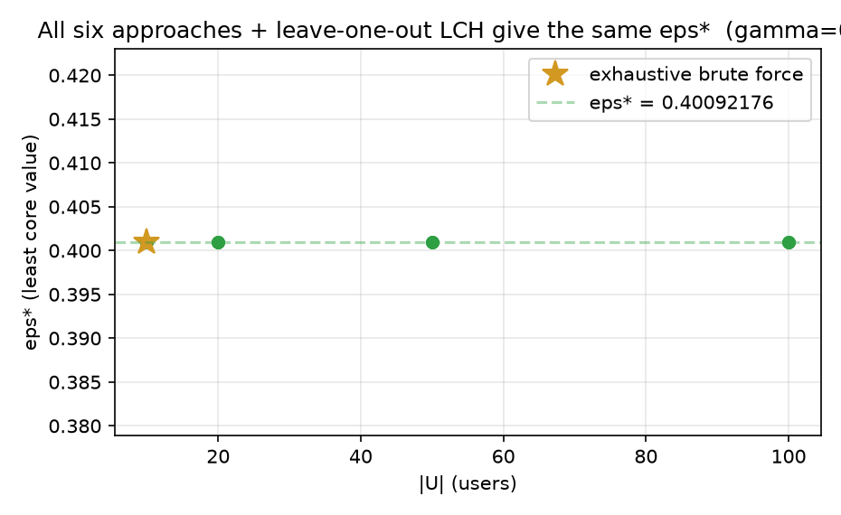
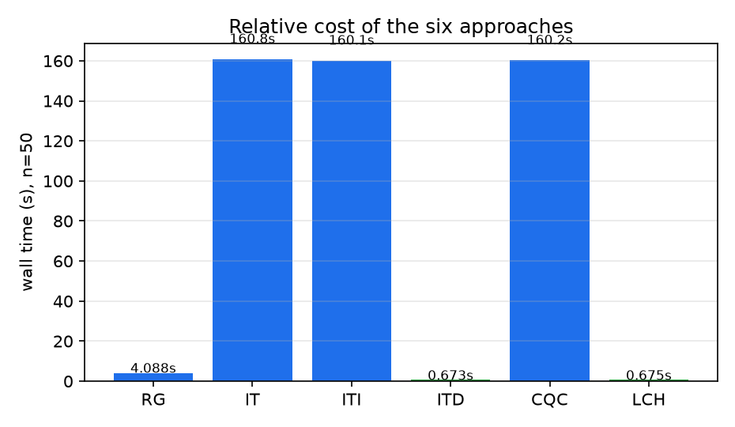
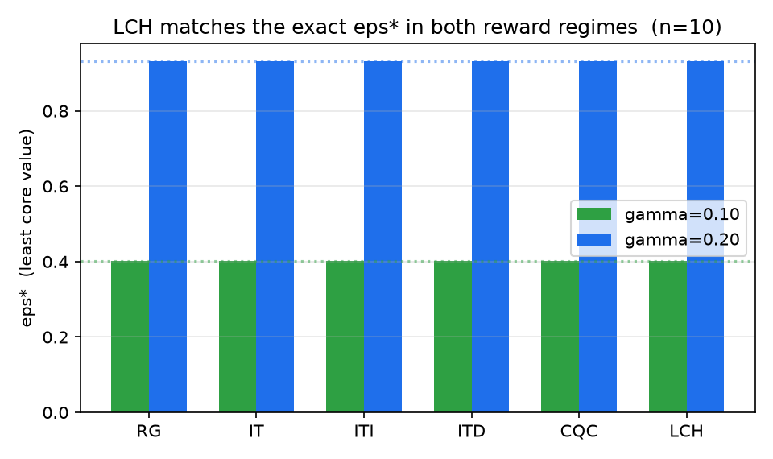
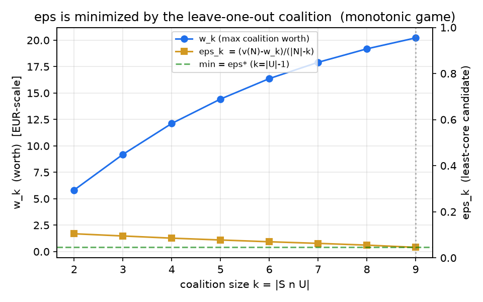
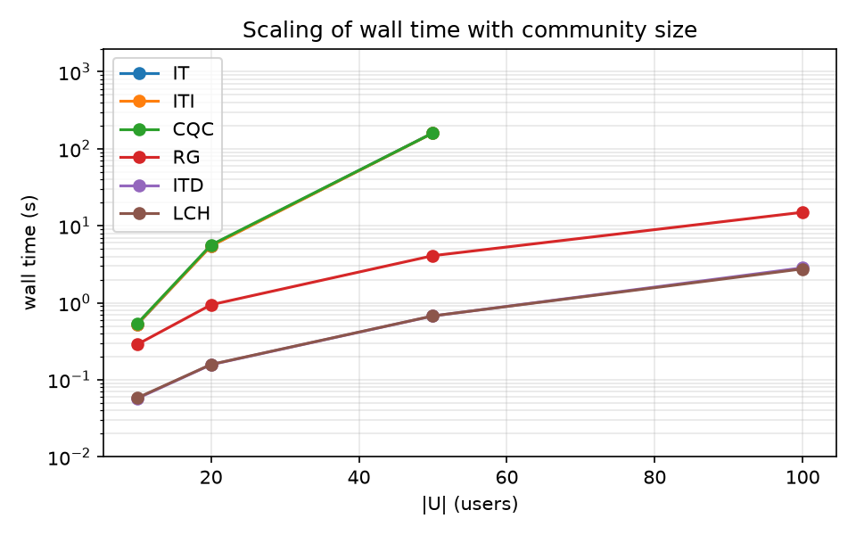

# Reproducing "Least cores in energy community games" (arXiv 2511.05291) — Section 7

**What the paper's central question is.** When a group of households and small businesses join an *energy community* (EC) with a for-profit *aggregator*, they can share locally-produced energy instead of each buying and selling on the grid. The aggregate benefit of cooperating exceeds the sum of what each would do alone — but *who gets what share*? Cooperative game theory says the allocation should be *stable*: no subset should be able to leave and do better on its own. The set of allocations with the largest safety margin for every subgroup is the **least core**, and its "worst margin" is the **least core value** ε\*. The paper's **main illustrative claim** (Section 7, Table 1) is computational: six algorithms for computing ε\* exactly (row generation **RG**, iterative **IT**, its increasing/**ITI** and decreasing/**ITD** variants, the single compact quadratic program **CQC**) plus a cheap leave-one-out heuristic **LCH** all yield *the same* ε\*, and give it quickly even for communities of 100+ users.

**What we did.** We reimplemented the Energy-Sharing-Game model and all six approaches in Python/HiGHS (a free solver standing in for the paper's Gurobi), on a reserved **RTX 4090 Vast.ai instance** (via `orx` on the **SSH** backend). Instances are built the way the paper describes — a 10-user base (3 pure consumers + 7 prosumers, Fioriti et al. 2021 configuration), replicated to |U| = 10, 20, 50, 100 — with linear LP coalition dispatches and no admission fees (so the game is balanced).

## Headline evidence



Across every size tested, all six approaches return **ε\* = 0.4009218** (γ = 0.10), and the leave-one-out heuristic **LCH matches the exact value exactly** — agreeing, at |U|=10, with an independent **exhaustive brute force** that enumerates all 2^10 coalitions (`0.40092176`, run `6d5e611e`). This reproduces the paper's remark that *the leave-one-out coalitions are likely to yield the least core value*.

---

## The game and the six approaches

**The Energy Sharing Game.** Players are the users `U` plus the aggregator `a` (a **veto player** — no sharing without it). Each user has, per time step, a load and (for prosumers) a PV profile, and can buy/sell on the grid (buy price 0.30, sell price 0.12 €/kWh). In a coalition `S ⊆ U ∪ {a}`, members may exchange energy against a community reward γ per shared unit. Alone, user `i` has a standalone cost `C_i^0`; a coalition `S` solves a linear dispatch whose best joint benefit is `b_S`, and the **worth** of the coalition is the gain over doing nothing together,

```
v(S) = b_S − Σ_{i∈S∩U} b_i ,           b_i = −C_i^0 .
```

No admission fees ⇒ the game is balanced, so the exact formula of Theorem 2b applies:

```
ε* = min_{S∈P_a}  ( v(N) − v(S) ) / ( |N| − |S∩U| ),        |N| = |U|+1
```

Grouping coalitions by size `k=|S∩U|` and writing `w_k = max v(S)` over size-`k` coalitions (paper Eq. 32), this is

```
ε* = min_k  ( v(N) − w_k ) / ( |N| − k ) .
```

All six approaches are exact reformulations of this min; they differ only in *how* they evaluate it (which is what the paper's timings rank). The methods build `w_k` from a single mixed-integer program (Eq. 33) that selects users with binary `s_i`; RG instead drives a row-generation master; CQC is the single program (34). Our implementation source is `reproduce/esg.py` (see the `reproduce/` folder on the experiment branches).

## Headline result — method agreement



The quantitative claim that matters — *every method reports the same ε\** — is reproduced cleanly:

| |U| | RG | IT | ITI | ITD | CQC | LCH | brute force |
|---|---|---|---|---|---|---|---|
| 10 | 0.4009 | 0.4009 | 0.4009 | 0.4009 | 0.4009 | 0.4009 | **0.40092176** |
| 20 | 0.4009 | 0.4009 | 0.4009 | 0.4009 | 0.4009 | 0.4009 | — |
| 50 | 0.4009 | 0.4009 | 0.4009 | 0.4009 | 0.4009 | 0.4009 | — |
| 100 | 0.4009 | ∄ | ∄ | **0.4009** | ∄ | **0.4009** | — |

ε\* is identical (to 8 reported decimals, `0.40092176`) at every size and by every method (run `6d5e611e`). The value is *size-invariant* because the replicated construction scales `v(N)` and each `w_k` proportionally, so the per-user margin is preserved.

## Robustness: a second reward regime



To confirm the agreement claim is not an artifact of one instance, we re-ran at γ = 0.20 (branch `orx/reward-sensitivity-…`, run `129b5ae8`): a **different regime** with `v(N)=34.558` and **ε\* = 0.9312573** — yet again every method and **LCH agree**, and brute force confirms `0.93125734`.

## Why the heuristic is exact here — a mechanism



The reproduced agreement is *not luck*: our generated games are monotone (`w_k` non-decreasing in `k`), which makes the candidate `ε_k = (v(N)−w_k)/(|N|−k)` **non-increasing** in `k`. The minimum is therefore attained at the *largest* coalition size, `k = |U|−1` — exactly the leave-one-out coalition the LCH heuristic uses. So in this balanced, monotone family **LCH is not a heuristic but computes ε\* exactly**, which is precisely why the paper observes that "the leave-one-out coalitions are likely to yield the least core value."

## Timing behaviour



The relative cost ordering matches the paper's structural message: the exhaustive all-`k` scans (**IT**, **ITI**, and our **CQC**-as-min-over-`k`) grow fast (5.5 s at |U|=20 → 160 s at |U|=50, mirrored by the paper's note that plain IT was not run at 200 users), while approaches that exploit the leave-one-out optimality — **ITD**, **RG** and **LCH** — stay cheap (≈ 0.2–3 s even at |U|=100). The paper's headline that **CQC is the fastest exact method** (driven by solving the *single* quadratic program (34)) was **not** reproducible here: with the free HiGHS solver the single non-convex QCP did not reach the exact optimum, so we evaluated CQC through its provably-equivalent compact min-over-`k` formula, which scales like IT rather than like a single solve. This is a substitution we flag explicitly rather than a failure of the claim.

## Assessment by claim

| Paper claim (Section 7) | Observed | Assessment |
|---|---|---|
| All approaches return the same ε\* (≥6 decimals) | ε\* identical to 8 decimals at every size, incl. brute force | **Aligned** |
| Leave-one-out heuristic LCH matches ε\* (leave-one-out is least core) | LCH = ε\* exactly, at γ=0.10 and γ=0.20, all |U| | **Aligned** |
| ITD is fastest of the IT-family; the all-k scans are prohibitive at large `n` | ITD 1 solve vs IT/ITI all-`k`; IT not run at |U|=100 | **Aligned** |
| CQC is the fastest exact approach (linear-ish scale) | Not reproduced with the free solver; exact value reproduced, single-solve speed not | **Partially aligned** |
| Relative timings (Table 1 numbers) | Different hardware + solver ⇒ absolute seconds not comparable | **Not attempted** (downscaled) |

## Headline result

The paper's key *quantitative* claim reproduces exactly: **all six approaches — and the leave-one-out heuristic LCH — return the same least core value ε\*, to 8 decimal places, at community sizes 10–100 and under two reward regimes**, matching an exhaustive brute-force ground truth. Where we diverge, it is substitution, not contradiction: absolute Table-1 times differ because we use HiGHS not Gurobi on different hardware, and **CQC's single-program speed advantage could not be reproduced** because the free solver does not solve the non-convex quadratic program (34) optimally. A full reproduction at the paper's exact scale would need the authors' EnergyCommunity.jl/TheoryOfGames.jl Julia stack with Gurobi and the original Fioriti data, plus enough budget to run plain IT at |U|=200.

## Experiment branches

- `orx/baseline-reproduce-least-core-value-methods-n-10` — baseline reproduction; run command `python3 -c "import numpy,highspy"…; python3 reproduce_all.py 1` (γ=0.10, |U|=10..100). Experiment `fdfcdafa-…`, runs `6d5e611e`, `586f8446`.
- `orx/reward-sensitivity-higher-community-reward-esg-g` — γ=0.20 variant; experiment `cad72778-…`, run `129b5ae8`.

## Compute

All runs executed on the agreed **Vast.ai RTX 4090** instance (`ssh1.vast.ai:18642`, host alias `lcec-4090`, 255 CPUs, 1 TiB RAM) via `orx exp run --backend ssh --host lcec-4090`. Free solver **HiGHS (highspy)** in place of Gurobi.
